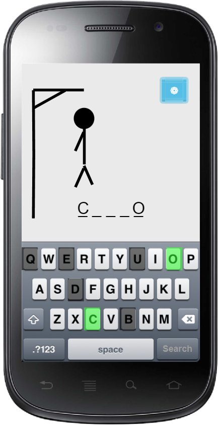

# 🛠️ Em Desenvolvimento! 🛠️

Esta aplicação ainda se encontra em desenvolvimento e muitas funcionalidades ainda não foram implementadas.

# JOGO DA FORCA

O "Jogo da Forca" é um aplicativo Android que permite que os usuários joguem o clássico jogo de adivinhação. O aplicativo oferece diversas categorias de palavras, como <code>profissões, frutas, animais, países e estados do Brasil</code>, para que os usuários possam selecionar um tema e começar a jogar imediatamente. Além disso, os usuários também têm a opção de criar um jogo personalizado, digitando a palavra e a dica da forca.

## Descrição Técnica

Este aplicativo foi desenvolvido em <a href="https://kotlinlang.org/">Kotlin</a> utilizando o <a href="https://developer.android.com/studio">Android Studio</a>. As palavras e dicas são pré-salvas em um arquivo <a href="https://www.json.org/">Json</a> que pode ser encontrado <a href="app/src/main/assets/words.json">aqui</a>.

Este projeto teve início de desenvolvimento em <code>14/04/2023</code> e durou até <code>o momento</code>.

## To-Do List
- [ ] Adicionar no Spinner de Temas de palavras, a opção de "Todas" presentes na aplicação.
- [ ] Utilizar View Binding para pegar o ID dos componentes.

## Galeria

### Captura(s)

Nesta seção são exibidas capturas de imagem e vídeo da aplicação desenvolvida.

### Protótipo(s)

Nesta seção são exibidas as telas de protótipo criadas no início do desenvolvimento da aplicação.

#### Tela principal

#### Tela de gameplay

## Tecnologia(s) Utilizad(s)
- [Kotlin](https://kotlinlang.org/)
- [Android Studio](https://developer.android.com/studio)
- [Gson](https://github.com/google/gson)
- [Material Design Components](https://m3.material.io/components)